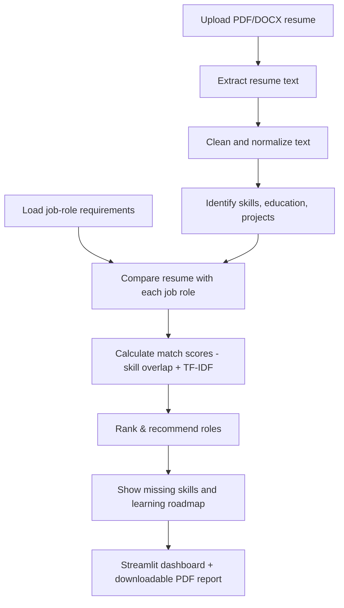

# Architecture & Workflow Diagram


```
 ┌─────────────────────┐
 │  1. Resume Upload   │  Streamlit file_uploader (PDF / DOCX)
 │     (app.py)        │  validates type & size, kept in memory only
 └──────────┬──────────┘
            │ raw bytes
            ▼
 ┌─────────────────────┐
 │  2. Text Extraction │  resume_parser.py
 │     & Cleaning      │  pypdf / python-docx  ->  text_cleaner.py
 └──────────┬──────────┘
            │ cleaned text
            ▼
 ┌─────────────────────┐
 │ 3. Skill Extraction │  skill_extractor.py
 │                     │  keyword match against data/skill_dictionary.csv
 └──────────┬──────────┘
            │ found_skills[]
            ▼
 ┌─────────────────────┐      ┌───────────────────────────┐
 │ 4. Job Role Dataset │ ---> │  data/job_roles.csv       │
 │    (job_matcher.py) │      │  role -> required skills  │
 └─────────┬───────────┘      └───────────────────────────┘
            │
            ▼
 ┌─────────────────────┐
 │  5. Matching &      │  job_matcher.py
 │     Recommendation  │  skill-overlap score (65%) + TF-IDF
 │                     │  cosine similarity (35%)  ->  ranked roles
 └──────────┬──────────┘
            │ ranked RoleMatch[]
            ▼
 ┌─────────────────────┐
 │  6. Skill-Gap       │  matched vs missing skills for the
 │     Analysis        │  selected target role
 └──────────┬──────────┘
            │ missing_skills[]
            ▼
 ┌─────────────────────┐
 │  Roadmap Generator  │  roadmap_generator.py
 │                     │  groups missing skills into weekly,
 │                     │  rule-based learning plan
 └──────────┬──────────┘
            │
            ▼
 ┌─────────────────────┐
 │  7. Streamlit       │  app.py
 │     Dashboard       │  charts, skill gaps, roadmap,
 │                     │  downloadable PDF report (report_generator.py)
 └─────────────────────┘
```

## Mermaid version (renders on GitHub)



## Module-to-file map

| Module (from project brief)        | File(s)                  |
|-------------------------------------|---------------------------|
| 1. Resume Upload                    | `app.py`, `resume_parser.py` |
| 2. Text Extraction & Cleaning       | `resume_parser.py`, `text_cleaner.py` |
| 3. Skill Extraction                 | `skill_extractor.py`, `data/skill_dictionary.csv` |
| 4. Job Role Dataset                 | `data/job_roles.csv`, `job_matcher.py` |
| 5. Matching and Recommendation      | `job_matcher.py` |
| 6. Skill-Gap Analysis               | `job_matcher.py`, `roadmap_generator.py` |
| 7. Streamlit Dashboard              | `app.py` |
| Downloadable report (advanced)      | `report_generator.py` |
| Testing                             | `tests/test_pipeline.py`, `tests/test_cases.csv` |